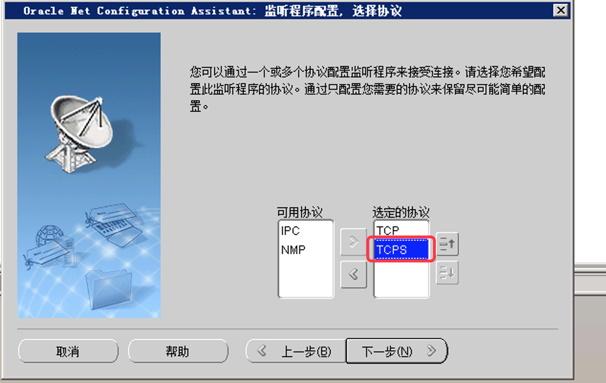
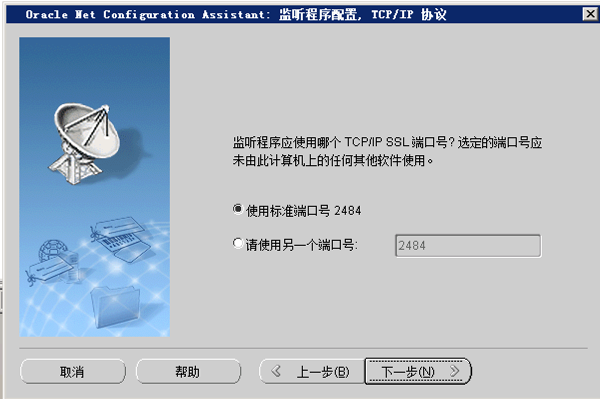

# oracle安全策略设置

1、数据库未设置密码复杂度策略和密码定期更新策略

先查看用户密码过期策略，默认是DEFAULT

```
select username,profile from dba_users where username in ('TFDS','SYSTEM');
```

查看DEFAULT策略的过期时间（UNLIMITED表示无限制）

```
select * from dba_profiles where profile='DEFAULT' and resource_name='PASSWORD_LIFE_TIME';
```

修改默认过期天数（Oracle默认是180天，如果一个季度一修改是90天） 

```
alter profile default limit password_life_time 180;
```

降低用户的权限，之前的用户应该都是赋予了dba权限，现在撤销，保留connect和resource权限

```
revoke dba from 用户名;
```

2、限制非法登录尝试次数，超尝试次数后实现锁定或自动退出,登录超时

查看登录失败限制次数

```
select * from dba_profiles s where s.profile='DEFAULT' and resource_name='FAILED_LOGIN_ATTEMPTS'
```

修改登录失败限制次数

```
alter profile default limit failed_login_attempts 10;
```

查看登录超时设置

```
select * from dba_profiles where profile ='DEFAULT' and resource_name='IDLE_TIME'
```

修改登录超时

```
alter profile default limit idle_time 30;
```

3、开启数据库审计功能

检测是否开启审计

```
conn /as sysdba
show parameter audit
```

执行结果：

NAME                 TYPE    VALUE

------------------------------------ ----------- ------------------------------

audit_file_dest           string   /u01/app/oracle/admin/ORCL/adump

audit_sys_operations         boolean   FALSE

audit_trail             string   DB

相关参数说明：

Audit_sys_operations：

默认为false，当设置为true时，所有sys用户（包括以sysdba, sysoper身份登录的用户）的操作都会被记录，audit trail不会写在`aud$`表中，这个很好理解，如果数据库还未启动`aud$`不可用，那么像conn /as sysdba这样的连接信息，只能记录在其它地方。如果是windows平台，audti trail会记录在windows的事件管理中，如果是linux/unix平台则会记录在audit_file_dest参数指定的文件中。

audit_trail ：

1. NONE：不开启

2. DB：开启审计功能

3. OS：审计记录写入一个操作系统文件。

4. TRUE：与参数DB一样

5. FALSE：不开启审计功能。

Oracle11g默认已经开启了审计；

执行

```
select * fromsys.aud$

select * from dba_audit_trail
```

可以查看记录审计记录中事件的日期、时间、类型、主体标识、客体标识和结果等记录情况；

修改策略1:开启`Audit_sys_operations`

```
 alter system set audit_sys_operations=TRUE scope=spfile;
```

修改策略2: 增加审计结果的丰富度，将执行sql进行存储

```
# 将审计结果放在数据库表中，并额外记录SQL_BIND和SQL_TEXT(具体执行语句)
alter system set audit_trail=db_extended scope=spfile;
```

上述策略修改之后需要重启实例

```
# 重启数据库
shutdown immediate
startup
```

测试点:

> 询问是否严格限制数据库管理员权限，系统管理员能否进行与审计相关的操作。用户可以通过alter system set audit_trail='NONE' scope=spfile;,查看是否成功；

非管理员（sysdba/sysoper）用户不能修改或者中断日志相关配置，因此需要检查下sysdba、sysoper被授予给了谁（应用系统的用户不要直接设置dba角色）

4、所有账户采用最小授权原则，建立独立的安全审计账户

```
# 创建新用户
create user shenjiyuan identified by passw0rd; 
#赋予新用户连接权限
grant connect,resource to shenjiyuan;   
# 赋予新用户查询审计信息
grant select on sys.aud$ to shenjiyuan;
grant select on dba_audit_trail to shenjiyuan;
 # 赋予新用户查询审计信息
grant select on sys.dba_fga_audit_trail to shenjiyuan
```

5、数据库远程管理过程中未采取必要措施防止鉴别信息在网络传输过程中被窃听

使用Oracle自带的Net COnfiguration Assistant 进行监听程序的重新配置，增加TCPS协议



新增了TCPS，因此新增一个默认端口用户默认加密通信



linux安装修改Oracle的监听配置文件，增加`PROTOCOL = TCPS`此项配置

```
LISTENER =
  (DESCRIPTION_LIST =
    (DESCRIPTION =
      (ADDRESS = (PROTOCOL = TCP)(HOST = WIN-T64IFR64RFH)(PORT = 1521))
      (ADDRESS = (PROTOCOL = TCPS)(HOST = WIN-T64IFR64RFH)(PORT = 2484))
    )
  )
```

6、数据库自身未限制终端接入地址限制

编辑安装目录下（xxx\product\11.2.0\dbhome_1\NETWORK\ADMIN）的sqlnet.ora文件，增加下述配置表示开启ip白名单

tcp.invited_nodes的括号后面加上允许的白名单，tcp.validnode_checking表示是否开启ip控制

```
tcp.validnode_checking=yes

tcp.invited_nodes=(192.168.1.7,127.0.0.1)
```

修改完重启Oracle的监听服务。


7、设置运维三权分立

执行对应sql

参考文档：

1. [Oracle安全测评自查1](https://www.freebuf.com/articles/database/249741.html)
2. [Oracle安全测评自查2](https://www.cnblogs.com/yhx1314-qzf/p/14384348.html)
3. [Oracle审计功能](https://www.cnblogs.com/CodingArt/articles/1653315.html)
4. [Oracle审计
5. [](https://www.freebuf.com/articles/database/243788.html)