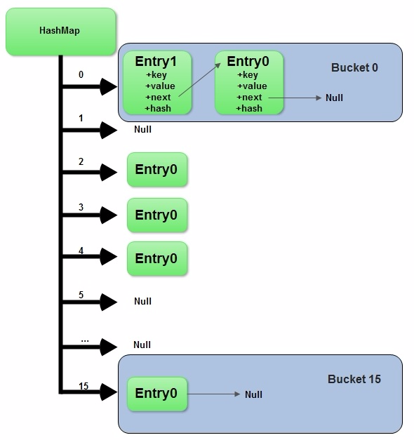

## 结构

Hashmap在内存中的存储形式为数组+链表，当新建一个Hashmap的时候就会初始化一个数组，数组中的元素为 Node[]



```

transient Node<K,V>[] table;

static class Node<K,V> implements Map.Entry<K,V> {
        final int hash;
        final K key;
        V value;
        Node<K,V> next;
        ...
}
```


## 存取实现

### 存入


### 读取

## 扩容


## 线程安全

