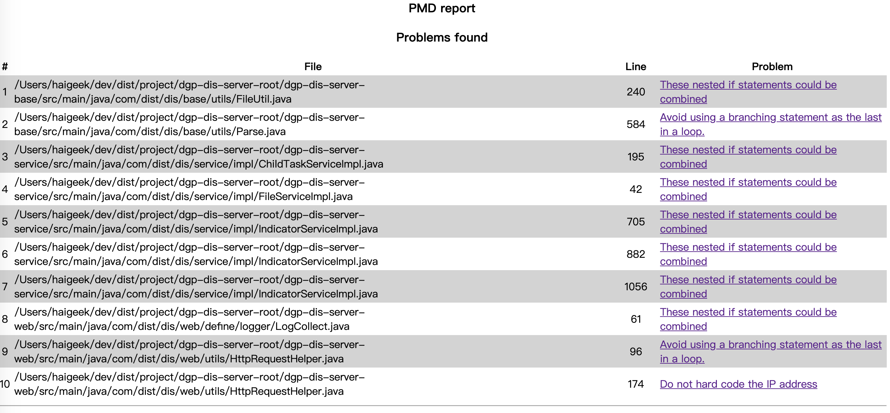
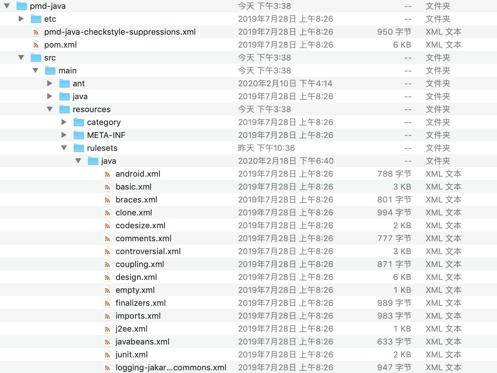

# PMD代码审查工具入门

## 安装

在官方仓库下载安装包解压后即可直接使用，支持下载的有可运行程序和源码。

下载地址：https://github.com/pmd/pmd/releases/tag/pmd_releases%2F6.17.0


在下载完bin程序可以直接在命令行执行代码检测。

如果需要对检测规则进行自定义，则需要下载src对其中的规则文件进行自定义。

## 使用与配置

### 命令行检测

可以通过一个脚本了解命令编写规则

```sh
 # 准备环境信息
 CUR=`PWD`
 echo 当前工作目录:${CUR}
 basepath=$(cd `dirname $0`; pwd)
 echo 当前执行的脚本文件的父目录:${basepath}
 PMD_HOME=$basepath/pmd-bin-6.17.0
 echo PMD_HOME:${PMD_HOME}
 PROJ_DIR=$(cd ${basepath}; cd ../../; pwd)
 echo PROJ_DIR:${PROJ_DIR}


SRC=${PROJ_DIR}/app/src/main/java
FORMAT=html
RULE=rulesets/java/basic.xml
OUTDIR=${PROJ_DIR}

${PMD_HOME}/bin/run.sh pmd -d ${SRC} -f ${FORMAT} -R ${RULE} >${OUTDIR}
```

通过bin文件夹下的启动程序启动扫描，

`-d` 参数指定要扫描的文件或者文件夹

`-f` 设置设置输出的结果格式

`-R` 设置使用的扫描规则 （支持自定义路径）默认规则存储在程序的lib包，路径为`rulesets/java/basic.xml` 支持更改为不同的规则，如`rulesets/java/quickstart.xml` 

 `>` 输出位置 

输出的html文件结果如下：



eg：一个使用自定义规则的例子

```
/Users/haigeek/software/pmd-bin-6.17.0/bin/run.sh pmd -d /Users/haigeek/dev/dist/project/dgp-dis-server-root -f html -R /Users/haigeek/software/pmd-src-6.17.0/pmd-java/src/main/resources/rulesets/java/quickstart-dist.xml >/Users/haigeek/Downloads/result.html
```


### 自定义检测规则

pmd默认提供了很多的检测规则供使用，支持对多种语言进行检测。

针对JAVA来说，主要分为以下几个大类：

- [Best Practices](https://pmd.github.io/latest/pmd_rules_java.html#best-practices) 最佳实践
- [Code Style ](https://pmd.github.io/latest/pmd_rules_java.html#code-style) 代码风格
- [Design](https://pmd.github.io/latest/pmd_rules_java.html#design) 设计
- [Documentation ](https://pmd.github.io/latest/pmd_rules_java.html#documentation) 文档
- [Error Prone](https://pmd.github.io/latest/pmd_rules_java.html#error-prone) 容易出错
- [Multithreading](https://pmd.github.io/latest/pmd_rules_java.html#multithreading) 多线程
- [Performance](https://pmd.github.io/latest/pmd_rules_java.html#performance) 性能
- [Security](https://pmd.github.io/latest/pmd_rules_java.html#security) 安全
- [Additional rulesets](https://pmd.github.io/latest/pmd_rules_java.html#additional-rulesets) 附加规则

打开pmd-src-6.17.0（源码包）可以按照存放配置规则的xml文件，可以对xml文件进行属性增加或注释的操作来完成已有规则的修改



我们默认选用该目录下的quick-start规则包来进行代码的检查

### 自行编写规则

待补充

## 