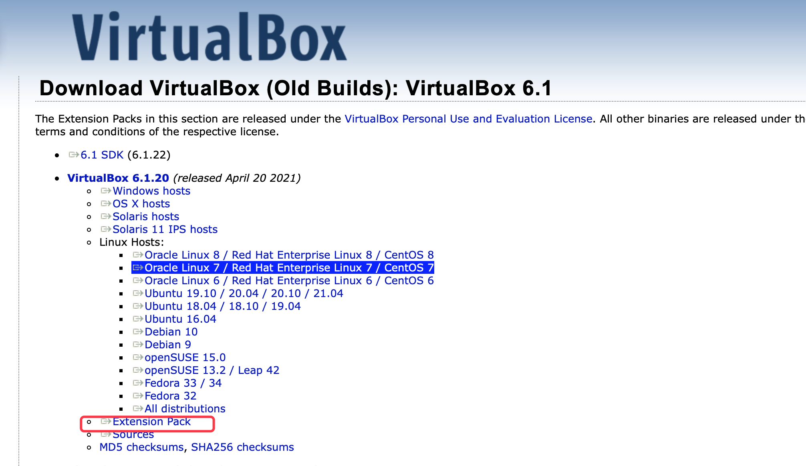
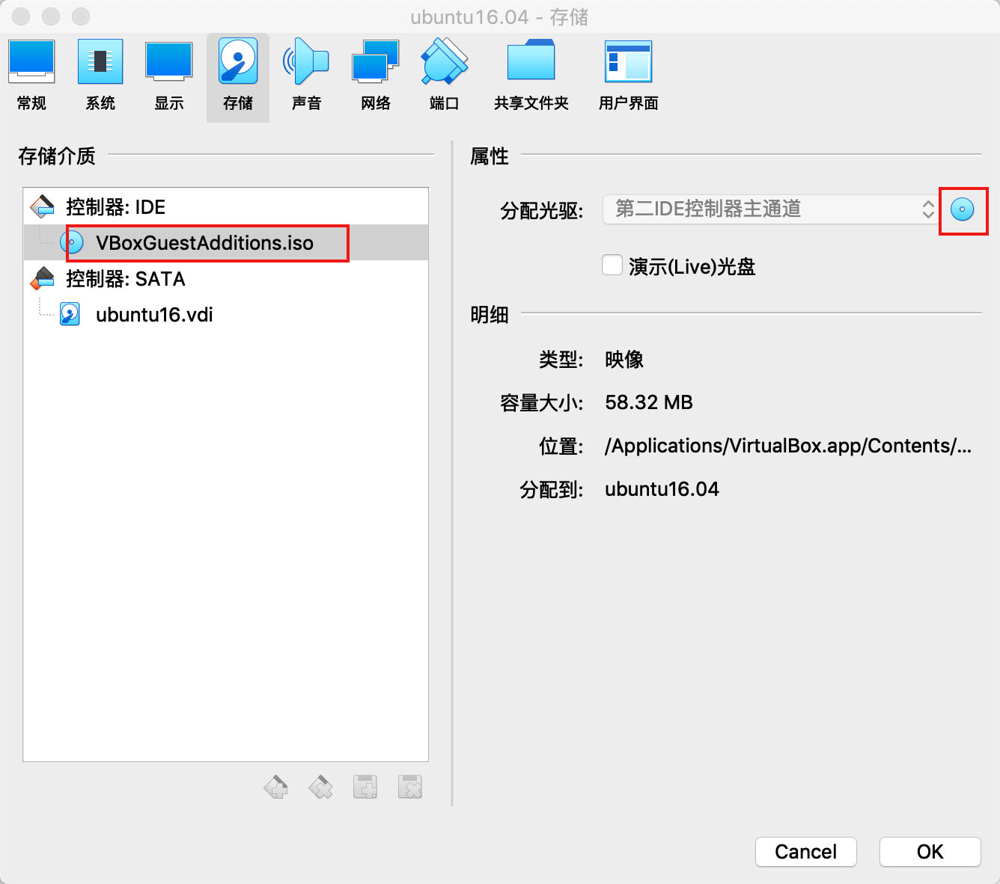
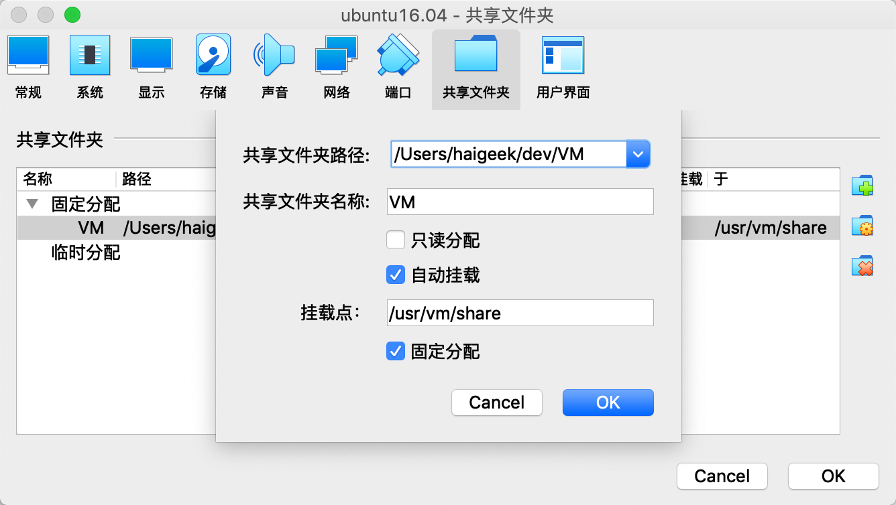

## 设置静态ip

## 与主机共享文件夹

1、找到对应的版本的拓展包进行下载

 下载地址：https://www.virtualbox.org/wiki/Download_Old_Builds




2、挂载拓展包到虚拟机

双击下载好的`Oracle_VM_VirtualBox_Extension_Pack-6.1.18.vbox-extpack`

virtualBox会将拓展包放在程序目录下，此时选择已经创建好的虚拟机，将iso文件导入



3、进入虚拟机进行拓展程序的安装

3.1 将iso文件进行挂载

```
# /home/vbox 文件夹需要新建
mount /dev/cdrom  /home/vbox
```

3.2 执行安装程序

```
cd /home/vbox
sh ./VBoxLinuxAdditions.run
```

4、在virtualBox创建共享文件夹

勾选自动挂载



5、执行命令进行共享文件夹的挂载

```
mount -t vboxsf VM /usr/vm/share
```

需要注意的是对于宿主机来说，需要输入共享文件的名称而不是路径

6、重启虚拟机生效