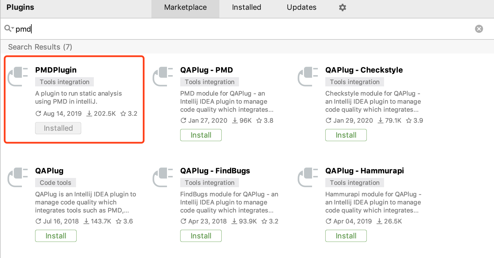
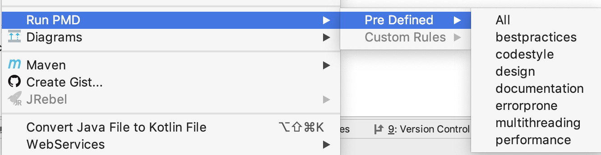
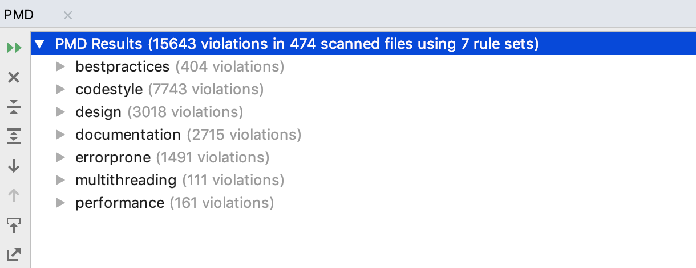
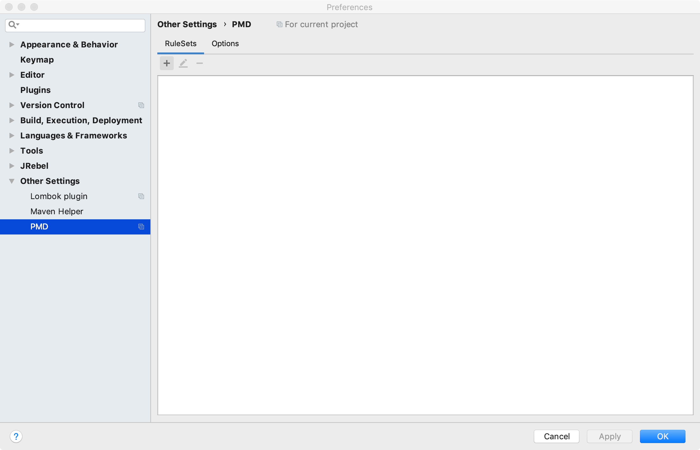

# PMD代码质量审查

## pmd代码规则

关于pmd的规则有官方的介绍文档有详细的介绍：

https://pmd.github.io/latest/pmd_rules_java.html

## idea插件

为了在开发中快速完成对代码质量的检测，选择安装pmd插件来完成代码检测的工作



选择文件或者目录进行扫描



选择所有规则进行扫描，扫描结果如下：



扫描结果可以定位到具体的文件位置并给出了具体的修改建议。使用全部的规则会有大量的需要修改的地方，我们在quick-start默认规则做一些自定义修改之后，使用这个规则进行扫描

导入自有的规则：



## 代码规范调整（自定义）

根据扫描的结果，取消了一些不是非常重要的规范

### Error级别

#### codestyle

- ClassNamingConventions

原规则：

```
<property name="utilityClassPattern" value="[A-Z][a-zA-Z0-9]+(Utils?|Helper)" />
```

变更：

```
<property name="utilityClassPattern" value="[A-Z][a-zA-Z0-9]*" />
```

### waring级别

#### codestyle

- unnecessaryannotationvalueelement（注解可以不使用value来定义值） 取消

#### bestpractices

- usecollectionisempty  使用java.util.Collection上的isEmpty（）方法来确定集合中是否包含任何元素。将size（）的值与0进行比较不能像inEmpty（）方法那样传达意图。 取消
- guardlogstatement 在使用log.info的时候，先检查下log.isInfoEnabled()是否打开，依次来节省不必要的String创建和操作 （取消）

## 外网代码规范点

对在线填报代码使用quick-start扫描之后，修改了下述规则所设计的代码：

### Error级别

#### codestyle

- ClassNamingConventions 

  class的命名

- methodnamingconventions

  方法的驼峰命名

- formalparameternamingconventions

  参数的驼峰命名

- localvariablenamingconventions

  本地变量驼峰命名

#### errorprone

- returnemptyarrayratherthannull

  返回空数组而不是null

### design

- classwithonlyprivateconstructorsshouldbefinal

  具有私有构造方法的类应该被声明为final

### waring级别

#### bestpractices

- AvoidUsingHardCodedIP ip地址编码使用硬编码
- unusedformalparameter 清理未使用的参数
- unusedlocalvariable 清理未使用的本地变量
- switchstmtsshouldhavedefault 使用switch应该具有default
- PositionLiteralsFirstInComparisons 文本比较时讲文本放在前面避免空指针异常（idea快捷键可完成）
- unusedprivatefield 清理无用的私有字段
- forloopcanbeforeach 使用foreach代替for循环（使用idea快捷键可处理）
- missingoverride 方法缺少@override注解

#### codestyle

- unnecessaryconstructor 不必要的构造函数
- controlstatementbraces if语句加{}
- unnecessarylocalbeforereturn 在返回之前避免再创建一个本地变量（直接使用idea快捷键优化）
- identicalcatchbranches 将抛出的多个catch进行折叠（直接使用idea快捷键优化）

#### errorprone

- uselocalewithcaseconversions （进行`String::toLowerCase()/toUpperCase()`转换时，请使用显式的语言环境参数来指定大小写转换规则，问题是默认语言环境取决于当前的JVM设置通常取决于它运行所在的系统，例如，在土耳其语中，大写形式的`i`是`İ`（U + 0130，不是ASCII），而不是英语的`I`（U + 0049））

- closeresource 关闭资源

  关闭资源需要对规则文件进行自定义

#### design

- finalfieldcouldbestatic 如果将final字段分配给编译时常量，则可以将其设为静态，从而在运行时节省每个对象的开销。
- simplifybooleanreturns 返回布尔值时，避免不必要的if-then-else语句。可以返回条件测试的结果。此处修改可以直接借助idea的alt+enter修改

#### performance

- optimizabletoarraycall 调用集合的`toArray(E[])`方法应指定大小为零的目标数组。这允许JVM尽可能优化内存分配和复制。

#### multithreading

- unsynchronizedstaticformatter  java.text.Format不是线程安全的，使用的时候推荐需要同步操作

## 待讨论

存在一些规则需要讨论之后再确定是否引入

### errorprone

- closeresource 关闭资源 关闭资源的检测语法必须为try-catch-finally的格式，存在一些的确关闭了资源但是没有在finally中关闭，所以会扫描出存在部分不合规范的语法；

- assignmentinoperand 在条件语句中不要使用对操作数中赋值；这会使代码更加复杂且难以阅读。

### bestpractices

- emptycatchblock 捕捉异常但是使用不抛出
- preservestacktrace 当抛出Exception异常  但是使用自定义异常throw 导致错误堆栈丢失 不易调试

### documentation

- uncommentedemptyconstructor （未注释的空构造函数查找实例，其中的构造函数不包含语句，但是没有注释。通过注释空的构造函数，可以更容易地区分有意的（注释）和无意的空构造函数） 
- uncommentedemptymethodbody 未注释的空方法主体查找方法主体不包含语句但没有注释的实例。通过显式注释空方法主体，可以更容易地区分有意（注释）和无意空方法。

### design

- UseUtilityClass 工具类方法使用lombok@UtilityClass的注解为工具类自动生成私有构造器、并将方法转化为静态方法（待讨论）

### info级别的规则（暂时未处理）

#### bestpractices

- unusedimports 没有使用的引用，同时不推荐使用*来进行宽泛的引用

#### codestyle

- genericsnaming  泛型：引用通用值的名称应限制为单个大写字母。
- uselessparentheses 删除多余的括号
- unnecessaryfullyqualifiedname 在代码中不需要引入完整的包名
- OneDeclarationPerLine 不要在一行中同时定义两个变量，会引起代码混乱


