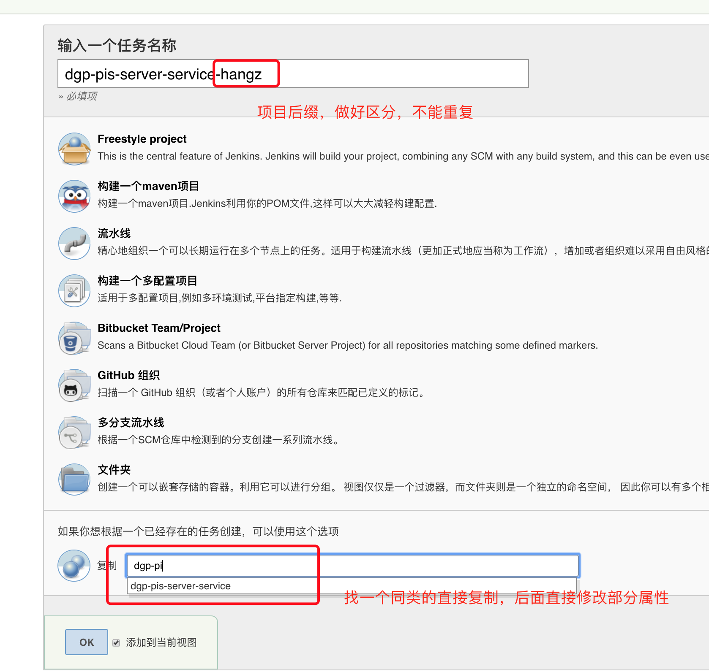
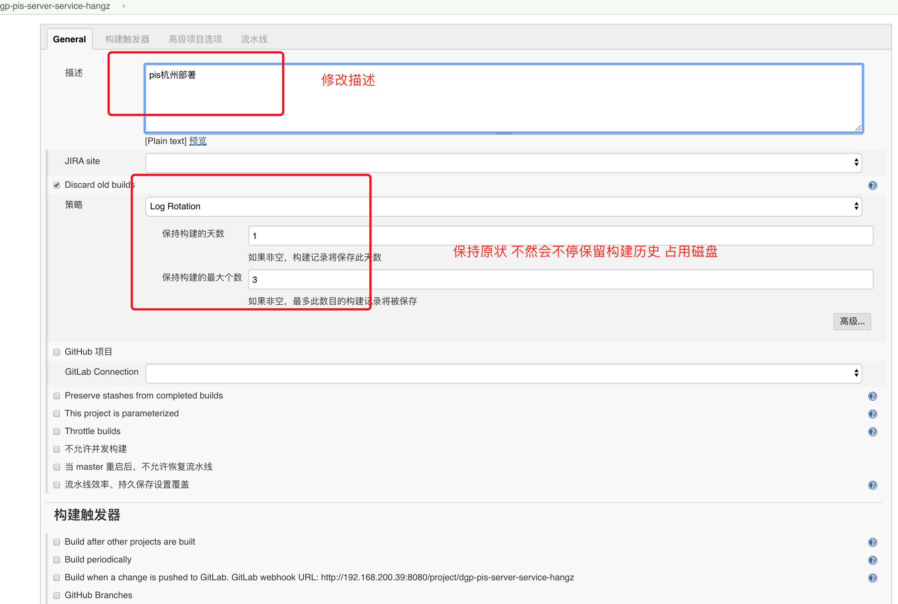

# Jenkins快速复制已经存在的项目

针对已经存在的项目，可以快速复制出来，创建新的任务

前提是需要200.39服务器可以访问目标部署服务器，假如不支持访问，需要先配置目标服务器，后续写配置方式（熟练的话5分钟可配置完成）。

## 具体步骤

### 1、创建任务



### 2、配置流水线

需要准备的数据有：

- 服务器ip
- tomcat文件夹
- gitlab仓库地址（明确分支）

修改描述



修改流水线脚本，**注意不要直接复制我的下面样例流水线配置，直接从复制出来的修改即可。**

主要做以下操作

1、修改ip地址和tomcat的webapps地址，这里有个需要有注意的地方，**假如tomcat的地址不存在空格的话，可以直接修改相关配置即可**。具体看注释1、2、3、4、5

2、假如tomcat存在空格（不存在的话忽略此条），处理相对麻烦（暂时未攻克），直接参考注释6（相当于直接拼接出scp命令），**另外配置了这种方式，步骤1可以不配置**

3、设置gitlab地址和分支（拉代码需要有凭证，可以在jenkins添加，添加后才有访问仓库权限，目前凭证：zhaohj也就是赵海杰可以访问仓库的才能正常拉），修改位置在注释7

4、设置打包命令和打包环境（如果复制的项目属于同类，基本不用改，确认下即可），修改在注释8，否则重新写打包命令。**此处一定要明确部署采用什么环境，推荐先去服务器复制已经有的配置，然后修改代码的test配置，走test环境部署**。

5、确认要发送的war包，同上（如果复制的项目属于同类，基本不用改，确认下即可），否则就修改为target要发送的war包，修改地方在注释9

6、全部修改完build测试，后续可以稳定使用


```

pipeline {
    environment {
        // 部署远程主机ip地址,需要通过密钥的方式设置免密登录
        //注释1 服务器ip
        remoteIp = "192.168.1.196"
        //注释2 服务器登录用户
        remoteName = "administrator"
        //注释3 服务器ssh端口
        remotePort='22'
        // 远程tomcat位置(使用/来表示路径)
        //注释4 tomcat安装位置
        tomcatPath = "D:/GT/Tomcat_zj"
        //注释5 tomcat所在磁盘
        tomcatPathDisk = "D:"
    }
    agent any
    tools {
        maven 'maven-3.6.1'
    }
    stages {
         stage('pullcode'){
            steps{
            		//注释7
                git branch: 'dev', credentialsId: 'zhaohjgitlab', url: 'http://elb-791125809.cn-northwest-1.elb.amazonaws.com.cn:5335/xdata/SH2019GH080/back-end/dgp-dubbo-server-root.git'
            }
        }

        stage('Build') {
            steps {
                sh '''
                    echo "开始编译打包过程"
                    echo "PATH = ${PATH}"
                    echo "M2_HOME = ${M2_HOME}"
                    //注释8
                    mvn clean package -P test -pl com.dist:dgp-pis-server-service -am
                '''
            }
        }
          stage('Test'){
            steps {
                sh 'echo "Test stage"'
            }
        }

        stage('Deploy') {
            steps {
                withEnv(['JENKINS_NODE_COOKIE=dontKillMe']) {
                    sh '''
                        export BUILD_ID=dontKillMe
                        echo "开始使用scp传输文件"
                        //注释9
                        warfile1=$(ls dgp-pis-server-service/target/*.war)
                        //注释6 假如不存在空格不需要加这一行
                         scp -P ${remotePort} "${warfile1}"  'administrator@192.168.200.122:"C:/Program Files/Apache Software Foundation/Tomcat8_hz/webapps"'
												//使用了注释6 下面这一行就没用了
                        scp -P ${remotePort} "${warfile1}"  ${remoteName}@${remoteIp}:${tomcatPath}/webapps
                        echo "等待tomcat自动部署"
                    '''
                }
            }
        }
    }
}
```

