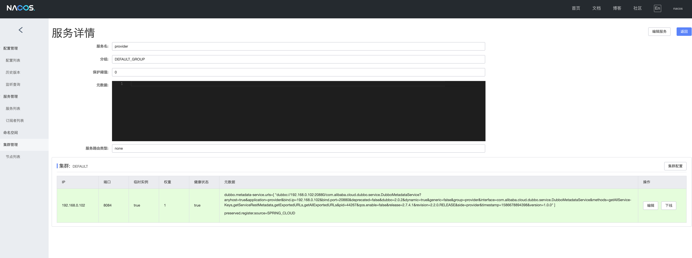
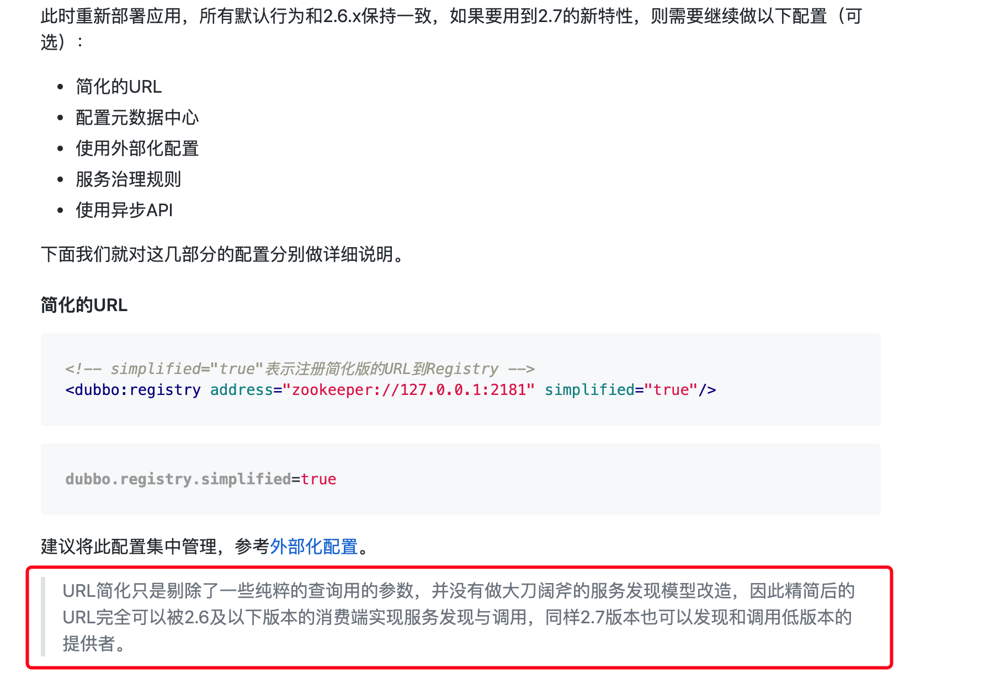

# SpringCloud-ALibaba对Rest与Rpc的支持

## SpringCloud-ALibaba服务提供方式与调用

这里主要分为三种场景进行介绍，基于SpringCloud-ALibaba微服务体系

### SpringCloud传统Rest调用

SpringCloud-ALibaba原生支持基于openfeign的调用方式，即可以按照Spring Cloud Netflix套件下编写微服务的方式来进行服务的暴露和调用，不同的是可以使用nacos进行服务发现，也可以使用其他服务发现（Eureka、zookeeper等），**也就是说SpringCloud-ALibaba具有兼容其他微服务套件的能力，可以很好的进行融合。**

首先定义接口，这里按照dubbo风格进行接口定义，也可以只是在一个服务模块里进行接口的定义，也可以不定义接口，直接在具体的服务类上设置路由。

接口定义：

```java
public interface RestService {
    @GetMapping("/param")
    String hello(@RequestParam String para);
}
```

接口实现：

```java
@RestController
public class RestServiceImpl implements RestService {
    @Override
    public String hello(String para) {
        return "hello rest "+para;
    }
}
```

服务调用：

```java
@RestController
public class HelloRestController {

    @Autowired
    @Lazy
    private RestService restService;

    @GetMapping("/rest/hello")
    public String hello(@RequestParam String para){
        System.out.println(restService.hello(para));
        return restService.hello(para);
    }

```

这种方式也是目前我们微服务改造的实现方式

### Dubbo的RPC调用

SpringCloud-ALibaba对Dubbo做了很好的融合，甚至可以理解为SpringCloud-ALibaba专门将dubbo迁移到了SpringCloud-ALibaba体系中，服务的注册与发现和使用原生dubbo框架没有差别。

接口定义：

```java
public interface EchoService {
    String hello(String para);
}
```

接口实现：

```java
@Service
public class EchoServiceImpl implements EchoService {
    @Override
    public String hello(String para) {
        return "hello"+para;
    }
}
```

这里的@service注解就是dubbo提供的 org.apache.dubbo.config.annotation.Service

服务调用：

```java
@RestController
public class HelloDubboController {

    @Reference
    private EchoService echoService;


    @GetMapping("/dubbo/hello")
    public String hello(@RequestParam String para){
        System.out.println(echoService.hello(para));
        return echoService.hello(para);
    }
}
```

服务调用使用org.apache.dubbo.config.annotation.Reference 注解，即可完成服务的调用


### 使用Feign调用Dubbo@Service提供的服务

上述两种方式相对独立，一种是传统概念的SpringCloud rest调用，一种是Dubbo框架的Rpc调用。SpringCloud-ALibaba一个比较重点的特性是将他们做了融合。对于这种融合也不算是非常神奇的事情，Rpc（远程过程调用）并非dubbo独有，dubbo提供了一种Rpc的实现，在SpringCloud-ALibaba还未诞生之前，dubbo官方文档对[如何开发Rest风格的远程调用](https://dubbo.apache.org/zh-cn/docs/user/rest.html)也有介绍，只不过相对比较麻烦。在SpringCloud-ALibaba诞生后，大大简化了开发Rest接口的步骤，也正好符合了SpringCloud的Rest调用的能力。在SpringCloud-ALibaba的GitHub也提供了[两个Rest风格的demo](https://github.com/alibaba/spring-cloud-alibaba/tree/master/spring-cloud-alibaba-examples/spring-cloud-alibaba-dubbo-examples)，分为是web提供者和非web提供者，这里主要介绍下web提供者方式。

接口定义：

```java
@FeignClient("provider")
@DubboTransported(protocol = "dubbo")
public interface DubboRestService {
    @GetMapping("/param")
    String hello(@RequestParam String para);
}
```

使用@FeignClient定义服务提供者

@DubboTransported是核心注解，实现了使用Feign调用Dubbo@Service提供的服务

接口实现：

```java
@Service
@RestController
public class DubboRestServiceImpl implements DubboRestService {
    @Override
    public String hello( String para) {
        return "hello dubbo rest"+para;
    }
}
```

@RestController实现了对Rest调用的支持，而dubbo的@service直接实现了服务注册，在nacos可以发现，服务的地址也不是dubbo的20880端口，可以我们服务提供者的rest接口：



接口调用：

```java
@RestController
public class HelloDubboRestController {


    @Autowired
    @Lazy
    private DubboRestService dubboRestService;

    @GetMapping("/dubbo/rest/hello")
    public String hello(@RequestParam String para){
        System.out.println(dubboRestService.hello(para));
        return dubboRestService.hello(para);
    }
}

```

可以看到，可以不再使用@Reference也完成了对dubbo服务的Rest调用。

但是个人理解，这种调用场景其实并不是非常常见，在具体的业务中也没有非常强的需求，**因为我们想实现rest调用可以直接使用SpringCloud传统Rest调用即可。**但是假如我们需要三方dubbo服务的时候（假如三方不提供rest接口），可以采用这种方式。

总体来说，我们更需要关注我们的服务提供能力而不是服务协议。

## 原生Dubbo服务如何使用SpringCloud-ALibaba服务

这里主要分析已有基于Dubbo框架的系统如何调用SpringCloud-ALibaba的提供的服务，目前整个微服务改造情况如下：

以支撑系统指标为例，指标已经完成了基于SpringCloud传统Rest调用的改造，并采用了dubbo开发风格提供二方Api包的方式，可以方便子系统调用。

但是对于实施监督系统来说，微服务改造尚未完成，服务调用方式依旧是@Reference方式，使用zk作为注册中心进行服务发现，假如希望改造完成的指标依旧可以提供dubbo调用能力的话，需要做以下步骤。

## 指标系统改造

### 1、增加@service注解

将服务使用@service进行暴露，原有的@RestController依旧保留（这样就同时支持了Rest和Dubbo Rpc调用）

### 2、增加zk注册中心兼容旧版dubbo应用

对于老版本的dubbo应用依旧采用zk注册的方式，这里可以这么操作,将被@Service标记的服务注册到zk，对于Rest的服务依旧注册到Nacos，具体配置如下：

```yml
spring:
  application:
    name: provider
  cloud:
    nacos:
      discovery:
        server-addr: 127.0.0.1:8848 #127.0.0.1:8848 #192.168.200.39:8848
#    zookeeper:
#      enabled: true
#      connect-string: 127.0.0.1:2181

dubbo:
  registry:
    address: zookeeper://127.0.0.1:2181
    simplified: true
  scan:
    # dubbo 服务扫描基准包
    base-packages: com.dist.cloud.provider.service
  protocol:
    # dubbo 协议
    name: dubbo
    # dubbo 协议端口（ -1 表示自增端口，从 20880 开始）
    port: -1
server:
  port: 8084
```

## 老dubbo应用改造

对于老dubbo应用的一个需求就是能否不改代码就可以调用新的服务，结论是目前的3.0.1 版本支持不佳（需要继续debug），但是2.6.0之后版本没有问题。

### dubbo不同版本互相调用

首先比较关心的一个问题是dubbo低版本是否可以调用高版本服务，dubbo官方也做了说明：



也就是说dubbo是提供了低版本高版本互相调用能力的

在实际的验证中也验证了我们使用的dubbo3.0.1是可以发现高版本dubbo提供的服务的，也就是说服务发现没有问题，但是依旧出现了调用失败的问题，错误异常如下：

```
RpcInvocation [methodName=hello, parameterTypes=[], arguments=null, attachments={path=com.dist.cloud.api.EchoService, input=195, dubbo=3.0.1, version=0.0.0}]
```

### 解决方案

一种解决方式是将dubbo版本升级到dubbo官方的版本，验证2.6.0调用没有问题，同时debug了2.6.0版本invoke时的参数，参数如下：

```
RpcInvocation [methodName=hello, parameterTypes=[class java.lang.String], arguments=[1], attachments={path=com.dist.cloud.api.EchoService, input=194, timeout_filter_start_time=1586621708650, dubbo=2.6.0, interface=com.dist.cloud.api.EchoService, version=0.0.0, timeout=500000}]
```

可以看出和我们已有3.0.1版本主要区别在于Rpc请求解析存在不一致的地方。但是还没有进行进一步debug为什么已有的3.0.1为何会调用失败。

**在实际操作中，dubbo版本由我们的3.0.1变更为2.6.0相对比较方便，只是改动了pom版本**。